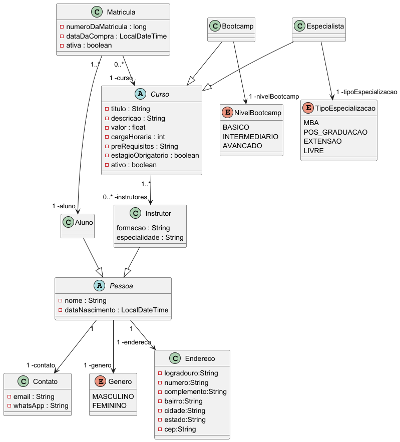

# Projeto Desenvolvido na Pós-graduação em Arquitetura de Software Infnet

## Disciplina Arquitetura Java [24E4_2]

Este projeto é um Sistema de Gerenciamento de Matrículas construído com Spring Boot.

## Tecnologias Utilizadas

- Java
- Spring Boot
- Spring Data JPA
- Spring Validation
- Maven
- H2 Database
- Swagger (Springdoc-Openapi)

## Modelagem do Domínio - Diagrama de Classes



## Features

- **Gerenciamento de Matrículas**: Adicionar, atualizar, excluir e listar matrículas.
- **Gerenciamento de Instrutores**: Adicionar, atualizar, excluir e listar instrutores.
- **Gerenciamento de Alunos**: Adicionar, atualizar, excluir e listar alunos.
- **Gerenciamento de Cursos**: listar cursos por faixa de preços e atualizar preços de cursos.
- **Gerenciamento de Bootcamps**: Adicionar, atualizar, excluir e listar bootcamps.
- **Gerenciamento de Especializações**: Adicionar, atualizar, excluir e listar especializações.
- **Integração com Swagger**: Documentação e teste da API usando Swagger UI.

## Executando a Aplicação

### Pré-requisitos

- Java 17 ou superior
- Maven

### Instalação

1. Clone o repositório:
    ```sh
    git clone https://github.com/silviobassi/silvioluizbassi.git
    cd silvioluizbassi
    ```

2. Build o projeto:
    ```sh
    mvn clean install
    ```

3. Execute a aplicação:
    ```sh
    mvn spring-boot:run
    ```

### Acessando a Aplicação

- A aplicação está disponível em `http://localhost:8080/`.
- O Swagger UI pode ser acessado em `http://localhost:8080/swagger-ui/index.html`.

## Configuração

### Database

A aplicação utiliza H2 in-memory database por padrão. Você pode configurar o banco de dados no arquivo
`application.yml`.

## Utilização

### API Endpoints

Os arquivos para executar os endpoints em um client como Postman estão disponíveis em `./PostmanEndpoints`.

- **Matrículas**
    -  `/matriculas/listar`: Lista todas as matrículas
    -  `/matriculas/criar`: Cria uma nova matrícula
    -  `/matriculas/1/atualizar`: Atualiza uma matrícula
    -  `/matriculas/2/buscar`: Recupera uma matrícula por ID
    -  `/matriculas/1/excluir`: Exclui uma matrícula por ID

- **Instrutores**
    -  `/instrutores/listar`: Lista todos os instrutores
    -  `/instrutores/criar`: Cria um novo instrutor
    -  `/instrutores/1/atualizar`: Atualiza um instrutor
    -  `/instrutores/2/buscar`: Recupera um instrutor por ID
    -  `/instrutores/3/excluir`: Exclui um instrutor por ID

- **Alunos**
    -  `/alunos/listar`: Lista todos os alunos
    -  `/alunos/criar`: Cria um novo aluno
    -  `/alunos/1/atualizar`: Atualiza um aluno
    -  `/alunos/2/buscar`: Recupera um aluno por ID
    -  `/alunos/2/excluir`: Exclui um aluno por ID

- **Cursos**
    -  `/cursos/listar`: Lista todos os cursos
    -  `/cursos/listarPorPrecos?precoInicial=6650&precoFinal=7000`: Lista todos os cursos por faixa de preço
    -  `/cursos/preco/atualizar`: Atualiza o preço de um curso

- **Bootcamps**
    -  `/bootcamps/listar`: Lista todos os bootcamps
    -  `/bootcamps/criar`: Cria um novo bootcamp
    -  `/bootcamps/1/atualizar`: Atualiza um bootcamp
    -  `/bootcamps/3/buscar`: Recupera um bootcamp por ID
    -  `/bootcamps/1/excluir`: Exclui um bootcamp por ID

- **Especializacao**
    -  `/especializacoes/listar`: Lista todas as especializações
    -  `/especializacoes/criar`: Cria uma nova especialização
    -  `/especializacoes/4/atualizar`: Atualiza uma especialização
    -  `/especializacoes/3/buscar`: Recupera uma especialização por ID
    -  `/especializacoes/2/excluir`: Exclui uma especialização por ID

---


